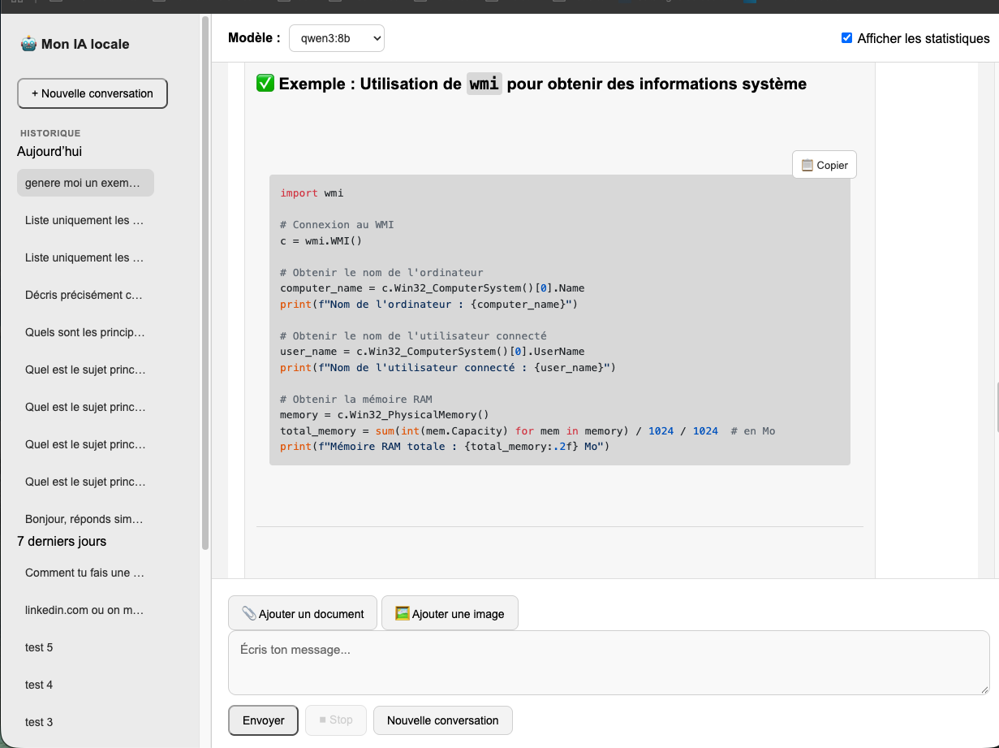

# 🤖 Mon IA locale

Application web de chat IA locale basée sur **Flask** et **Ollama**.

L'application permet d'utiliser des modèles de langage exécutés localement, avec une interface web, un historique des conversations, le streaming des réponses et l'affichage des statistiques de génération.

Elle permet également d'importer des documents PDF et Excel ainsi que des images afin de les analyser avec les outils et modèles locaux appropriés.

Aucune API cloud n'est nécessaire pour générer les réponses : les modèles sont fournis par une instance Ollama accessible par l'application.

---

## 🖥️ Interface



---

## ✨ Fonctionnalités

* 💬 Interface web de chat
* 🧠 Sélection du modèle IA
* ⚡ Réponses générées en streaming
* 🛑 Arrêt d'une génération en cours
* 📚 Historique des conversations
* ✏️ Renommage des conversations
* 🗑️ Suppression des conversations
* 📝 Persistance des conversations dans une base SQLite locale
* 📊 Statistiques de génération
* 🔐 Authentification par identifiant et mot de passe
* 🍪 Sessions sécurisées côté serveur
* 📝 Rendu Markdown des réponses
* 💻 Interface adaptée aux écrans desktop et mobiles
* 🔌 API HTTP interne pour les conversations et la génération
* 📄 Import et analyse de documents PDF
* 📊 Import et analyse de fichiers Excel (XLSX)
* 🔍 Questions basées sur le contenu des documents importés
* 🔎 OCR des PDF contenant des pages scannées
* 🖼️ Import et analyse d'images avec un modèle de vision
* 💾 Stockage local des fichiers importés
* 🧹 Données runtime exclues du dépôt Git

---

## 🧠 Modèles

Les modèles autorisés sont actuellement :

* `qwen3:8b`
* `qwen3:14b`
* `qwen3-vl:8b`

`qwen3-vl:8b` est utilisé pour l'analyse des images.

Les modèles sont exécutés localement par **Ollama**.

La liste des modèles autorisés peut être modifiée dans `config.py`.

---

## 📄 Documents et images

L'application permet d'importer des documents directement depuis l'interface de chat.

### Documents supportés

Les formats actuellement supportés sont :

* PDF
* XLSX (Excel)

Les documents sont stockés localement dans :

```text
data/documents/
```

Le contenu est extrait avant d'être transmis au modèle afin de permettre des questions basées sur le document.

### PDF

Les PDF sont traités avec une stratégie en plusieurs étapes.

L'application tente d'abord d'extraire directement le texte du PDF.

Pour les PDF contenant des pages scannées ou lorsque l'extraction directe ne fournit pas suffisamment de texte, un traitement OCR est utilisé.

Les outils système utilisés sont notamment :

* `pdfinfo`
* `pdftotext`
* `pdftoppm`
* `tesseract`

Le français est pris en charge par le moteur OCR Tesseract.

### Excel

Les fichiers XLSX sont analysés avec la bibliothèque Python `openpyxl`.

Les informations extraites peuvent ensuite être utilisées pour répondre à des questions sur le contenu du classeur.

Les fichiers Excel sont stockés localement dans :

```text
data/documents/
```

### Images

Les formats actuellement supportés sont :

* JPG
* JPEG
* PNG
* WEBP

Les images sont stockées localement dans :

```text
data/images/
```

Elles peuvent être envoyées au modèle de vision `qwen3-vl:8b`.

Le modèle peut notamment analyser :

* le contenu visuel d'une image
* le texte visible dans l'image
* la structure d'un document photographié ou numérisé
* les informations présentes dans un CV ou autre document
* les éléments demandés par l'utilisateur

Les fichiers importés sont des données runtime et ne sont pas versionnés dans Git.

---

## 📏 Limites d'importation

Les limites actuellement définies dans l'application sont :

| Type | Formats | Taille maximale |
| --- | --- | --- |
| Documents | PDF, XLSX | 20 MB |
| Images | JPG, JPEG, PNG, WEBP | 10 MB |

La taille maximale du contexte documentaire transmis au modèle est également limitée par l'application.

---

## 📊 Statistiques

Après chaque génération, l'application peut récupérer et afficher les statistiques fournies par Ollama, notamment :

* modèle utilisé
* nombre de tokens du prompt
* nombre de tokens générés
* nombre total de tokens
* durée de génération
* durée totale
* vitesse de génération en tokens/seconde

Ces informations sont également journalisées côté serveur.

---

## 🛠️ Architecture

L'architecture réelle actuelle du projet est :

```text
ai-chat/
├── app.py
├── conf/
├── config.py
├── conversations.py
│
├── document_loader.py
├── documents.py
├── documents_excel.py
├── prototype_excel_search.py
│
├── ollama_client.py
├── stats.py
├── requirements.txt
├── README.md
│
├── data/
│   ├── documents/
│   └── images/
│
├── img/
│   └── screen.png
│
├── static/
│   ├── app.js
│   └── style.css
│
└── templates/
    ├── index.html
    └── login.html
```

### `app.py`

Application Flask principale.

Elle gère notamment :

* authentification
* sessions utilisateur
* interface web
* API des conversations
* génération des réponses
* streaming des réponses
* arrêt d'une génération
* import des documents
* import des images
* envoi du contenu documentaire au modèle
* health check

### `config.py`

Configuration principale de l'application.

Elle charge notamment les variables d'environnement définies dans `.env` et contient la configuration des modèles autorisés ainsi que différents paramètres de l'application.

### `conversations.py`

Gestion de la persistance des conversations et des messages dans SQLite.

Elle permet notamment de :

* créer une conversation
* récupérer les conversations
* récupérer les messages
* renommer une conversation
* supprimer une conversation
* enregistrer les messages

### `ollama_client.py`

Client utilisé pour communiquer avec l'API HTTP d'Ollama.

Il gère notamment les requêtes de génération et leur streaming.

### `stats.py`

Construction des statistiques de génération à partir des données retournées par Ollama.

### `document_loader.py`

Point d'entrée commun pour le chargement des documents.

Il identifie le type de fichier et dirige le traitement vers le module approprié.

### `documents.py`

Gestion de l'extraction du contenu des fichiers PDF.

Le module utilise les outils système Poppler et Tesseract lorsque l'OCR est nécessaire.

### `documents_excel.py`

Gestion de l'extraction du contenu des fichiers Excel XLSX avec `openpyxl`.

### `prototype_excel_search.py`

Prototype utilisé pour expérimenter et tester la recherche dans le contenu des fichiers Excel.

Ce fichier n'est pas utilisé comme composant principal du fonctionnement de l'application.

### `static/`

Fichiers statiques de l'interface :

* `app.js` : logique JavaScript côté navigateur
* `style.css` : styles de l'interface

### `templates/`

Templates HTML utilisés par Flask :

* `index.html` : interface principale
* `login.html` : page d'authentification

### `data/`

Données runtime de l'application.

```text
data/
├── documents/
└── images/
```

Les fichiers importés par les utilisateurs sont stockés dans ces répertoires.

Ces données ne sont pas versionnées dans Git.

### `conf/`

Répertoire contenant les fichiers de configuration complémentaires du projet.

---

## 🔄 Architecture générale

Le fonctionnement global peut être représenté ainsi :

```text
                         ┌─────────────────┐
                         │    Navigateur   │
                         └────────┬────────┘
                                  │ HTTP
                                  ▼
                         ┌─────────────────┐
                         │   Flask / app   │
                         │     app.py      │
                         └───────┬─────────┘
                                 │
              ┌──────────────────┼──────────────────┐
              │                  │                  │
              ▼                  ▼                  ▼
       ┌─────────────┐   ┌──────────────┐   ┌─────────────┐
       │ Conversations│   │ Documents    │   │   Images    │
       │   SQLite     │   │ PDF / XLSX   │   │ JPG/PNG/... │
       └─────────────┘   └──────┬───────┘   └──────┬──────┘
                                 │                  │
                                 ▼                  ▼
                         ┌─────────────────────────────┐
                         │        Ollama Client        │
                         │     ollama_client.py        │
                         └──────────────┬──────────────┘
                                        │ HTTP
                                        ▼
                              ┌──────────────────┐
                              │      Ollama      │
                              └────────┬─────────┘
                                       │
                                       ▼
                              ┌──────────────────┐
                              │ Modèle local IA  │
                              │ Qwen / Qwen-VL   │
                              └──────────────────┘
```

---

## 📋 Prérequis

### Système

* Linux recommandé
* Python 3.10 ou supérieur
* Git
* Ollama
* au moins un modèle compatible installé dans Ollama

### Outils système pour les PDF et l'OCR

Le traitement des PDF nécessite les outils suivants :

* Poppler
* Tesseract OCR
* données linguistiques Tesseract françaises

Sur Debian/Ubuntu :

```bash
sudo apt update
sudo apt install poppler-utils tesseract-ocr tesseract-ocr-fra
```

Vérification :

```bash
pdfinfo -v
pdftotext -v
pdftoppm -v
tesseract --version
```

### Ollama

Vérifier Ollama :

```bash
ollama --version
```

Vérifier les modèles disponibles :

```bash
ollama list
```

Exemple :

```bash
ollama pull qwen3:8b
ollama pull qwen3:14b
ollama pull qwen3-vl:8b
```

---

## 🚀 Installation

Cloner le projet :

```bash
git clone https://github.com/lmalta/ai-chat.git
cd ai-chat
```

Créer un environnement virtuel :

```bash
python3 -m venv .venv
```

Activer l'environnement :

```bash
source .venv/bin/activate
```

Installer les dépendances Python :

```bash
pip install -r requirements.txt
```

Installer les outils système nécessaires aux PDF et à l'OCR :

```bash
sudo apt install poppler-utils tesseract-ocr tesseract-ocr-fra
```

---

## ⚙️ Configuration

L'application utilise un fichier `.env` à la racine du projet.

Créer le fichier :

```bash
nano .env
```

Exemple :

```env
OLLAMA_URL=http://127.0.0.1:11434
OLLAMA_TIMEOUT=600

DEFAULT_MODEL=qwen3:14b
TEMPERATURE=0.7

MAX_MESSAGE_LENGTH=10000
MAX_MESSAGES=50

AUTH_USERNAME=admin
SECRET_KEY=change-me
PASSWORD_HASH=change-me
```

### Authentification

L'application nécessite :

* `AUTH_USERNAME`
* `PASSWORD_HASH`
* `SECRET_KEY`

Le mot de passe n'est pas stocké en clair.

L'application utilise un hash compatible avec Werkzeug.

Pour générer un hash :

```bash
python -c "from werkzeug.security import generate_password_hash; print(generate_password_hash('VotreMotDePasse'))"
```

Copier ensuite le résultat dans :

```env
PASSWORD_HASH=...
```

### Sécurité du fichier `.env`

Le fichier `.env` contient des informations sensibles et **ne doit jamais être commité dans Git**.

Le `.gitignore` fourni avec le projet l'exclut.

---

## ▶️ Lancement

Pour lancer l'application directement avec Flask :

```bash
python app.py
```

L'application écoute alors sur :

```text
http://localhost:8080
```

Pour une utilisation avec Gunicorn :

```bash
gunicorn --bind 0.0.0.0:8080 app:app
```

Pour un déploiement permanent, il est recommandé d'utiliser un gestionnaire de service comme `systemd`.

---

## 🔄 Communication avec Ollama

L'application communique avec Ollama via son API HTTP locale.

Pour une génération classique :

```text
Navigateur
    │
    ▼
Flask
    │
    ▼
Ollama
    │
    ▼
Modèle local
    │
    ▼
Streaming de la réponse
    │
    ▼
Navigateur
```

Pour une image :

```text
Navigateur
    │
    ▼
Flask
    │
    ├── Image locale
    │
    ▼
Encodage de l'image
    │
    ▼
Ollama
    │
    ▼
qwen3-vl:8b
    │
    ▼
Réponse
```

Les réponses sont transmises progressivement au navigateur afin d'éviter d'attendre la fin complète de la génération.

---

## 🗂️ Conversations

Les conversations sont stockées localement dans une base SQLite.

L'application permet :

* de créer une conversation
* de charger une conversation existante
* de renommer une conversation
* de supprimer une conversation
* de conserver les messages utilisateur et assistant

La base de données locale n'est pas destinée à être versionnée dans Git.

---

## 📎 Gestion des documents

Lorsqu'un document est importé :

```text
Fichier utilisateur
       │
       ▼
Validation du format
       │
       ▼
Validation de la taille
       │
       ▼
Stockage local
       │
       ▼
document_loader.py
       │
       ├── PDF ──────► documents.py
       │                  │
       │                  ├── pdftotext
       │                  └── OCR Tesseract
       │
       └── XLSX ─────► documents_excel.py
                          │
                          └── openpyxl
       │
       ▼
Texte extrait
       │
       ▼
Contexte transmis au modèle
       │
       ▼
Réponse de l'IA
```

Les documents ne sont pas envoyés vers une API cloud.

---

## 🔌 API

Quelques endpoints utilisés par l'application :

| Méthode | Endpoint | Fonction |
| --- | --- | --- |
| `GET` | `/` | Interface principale |
| `GET` | `/login` | Page de connexion |
| `POST` | `/login` | Authentification |
| `GET` | `/logout` | Déconnexion |
| `GET` | `/health` | Vérification de l'état de l'application |
| `POST` | `/ask` | Génération d'une réponse |
| `POST` | `/cancel` | Arrêt d'une génération |
| `POST` | `/api/documents` | Import et analyse d'un document |
| `POST` | `/api/images` | Import d'une image |
| `GET` | `/api/conversations` | Liste des conversations |
| `POST` | `/api/conversations` | Création d'une conversation |
| `GET` | `/api/conversations/<id>` | Lecture d'une conversation |
| `PUT` | `/api/conversations/<id>` | Renommage |
| `DELETE` | `/api/conversations/<id>` | Suppression |

---

## 🔒 Sécurité

Quelques mesures sont intégrées à l'application :

* authentification obligatoire pour l'interface et les API protégées
* mot de passe stocké sous forme de hash
* clé secrète Flask fournie par variable d'environnement
* cookies de session `HttpOnly`
* cookies de session avec `SameSite=Lax`
* validation des modèles autorisés
* validation des messages reçus par l'API
* limitation de la taille des messages
* limitation du nombre de messages envoyés dans une conversation
* validation des extensions de fichiers
* limitation de la taille des documents
* limitation de la taille des images
* stockage local des fichiers importés

### Déploiement public

Cette application est conçue pour fonctionner avec des modèles locaux, mais **cela ne signifie pas que l'interface web doit être exposée directement sur Internet**.

Pour un déploiement accessible depuis Internet, il est recommandé de mettre en place au minimum :

* HTTPS
* un reverse proxy
* une politique firewall adaptée
* des identifiants robustes
* une gestion correcte des secrets
* une limitation d'accès réseau lorsque cela est possible

---

## 🧪 Développement

L'application peut être lancée directement avec Flask pendant le développement :

```bash
python app.py
```

Tester la syntaxe Python :

```bash
python -m py_compile app.py
```

Tester la syntaxe JavaScript :

```bash
node --check static/app.js
```

Installer les dépendances Python :

```bash
pip install -r requirements.txt
```

---

## 📦 Dépendances Python

Les principales dépendances Python de l'application sont :

* Flask
* Requests
* Gunicorn
* python-dotenv
* Markdown
* openpyxl

Les bibliothèques CUDA, PyTorch et les autres paquets liés à l'environnement GPU ne sont pas nécessaires au fonctionnement de Flask lui-même.

L'inférence des modèles est assurée par Ollama.

### Dépendances système

Le traitement PDF/OCR utilise également :

* Poppler
* Tesseract OCR
* `tesseract-ocr-fra`

Ces dépendances sont installées par le gestionnaire de paquets du système et ne figurent donc pas dans `requirements.txt`.

---

## 🗺️ Roadmap

Quelques pistes d'évolution possibles :

* amélioration continue de l'interface
* gestion plus avancée des paramètres de génération
* support de modèles supplémentaires
* amélioration de la gestion des conversations
* amélioration de la recherche dans les documents
* amélioration de l'analyse des documents complexes
* meilleure gestion du déploiement sécurisé
* ajout éventuel de fonctionnalités d'agent IA

La roadmap peut évoluer avec le projet.

---

## 📄 Licence

Aucune licence open source n'est actuellement déclarée dans ce dépôt.

Si le projet est rendu public, une licence peut être ajoutée selon les conditions d'utilisation souhaitées par le mainteneur.

---

## 🤝 Contribution

Les contributions, suggestions et retours sont les bienvenus.

Pour proposer une modification importante, il est recommandé d'ouvrir une issue afin de discuter de l'évolution avant de soumettre une pull request.